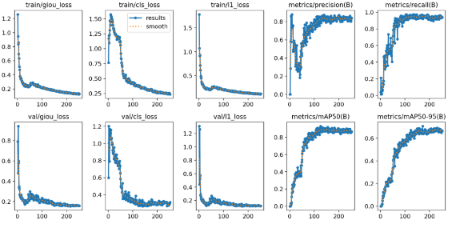
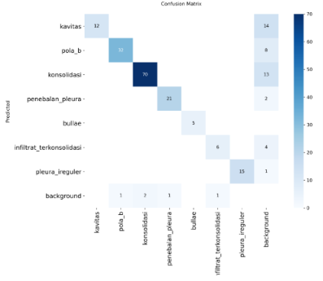
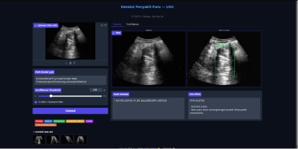

# CAD Tuberculosis and Pneumonia Detection Using Thoracic Ultrasound Images

## Overview

This project presents a Computer-Aided Detection (CAD) system for identifying pulmonary pathologies associated with Tuberculosis and Pneumonia using Thoracic Ultrasound (TUS) images.

The proposed system utilizes the RT-DETR (Real-Time Detection Transformer) architecture with an HGNetV2-L backbone pre-trained on the COCO dataset and fine-tuned using clinically annotated thoracic ultrasound images. The system is designed to assist healthcare professionals by automatically detecting and localizing pathological findings from lung ultrasound examinations.

---

## Research Highlights

- Computer-Aided Detection (CAD) for Thoracic Ultrasound
- Real patient dataset with expert-guided annotation
- RT-DETR deep learning model for object detection
- Multi-class pathology detection
- Ultrasound image preprocessing pipeline
- Desktop GUI for prediction and visualization

---

## Dataset Summary

| Item | Value |
|--------|--------|
| Total Patients | 22 |
| Imaging Modality | Thoracic Ultrasound (TUS) |
| Total Bounding Boxes | 841 |
| Total Background Frames | 4,884 |
| Pathology Classes | 7 |
| Annotation Method | Manual annotation with healthcare professionals |

> Due to patient privacy and ethical considerations, the dataset is not publicly available.

---

## Pathology Classes

The model was trained to detect the following thoracic ultrasound findings:

| Class ID | Pathology |
|----------|------------|
| 0 | Cavitation |
| 1 | B-Line Pattern |
| 2 | Consolidation |
| 3 | Pleural Thickening |
| 4 | Bullae |
| 5 | Consolidated Infiltrate |
| 6 | Irregular Pleura |

---

## Dataset Distribution

| Pathology | Bounding Boxes |
|------------|------------|
| Cavitation | 61 |
| B-Line Pattern | 163 |
| Consolidation | 365 |
| Pleural Thickening | 112 |
| Bullae | 27 |
| Consolidated Infiltrate | 37 |
| Irregular Pleura | 76 |
| **Total** | **841** |

---

## Image Preprocessing

The preprocessing pipeline was specifically designed to improve ultrasound image quality while preserving clinically relevant features.

### Preprocessing Steps

1. Grayscale Conversion
2. Contrast Limited Adaptive Histogram Equalization (CLAHE)
   - Clip Limit = 2.0
   - Tile Grid Size = 8×8
3. Bilateral Filtering
   - d = 9
   - sigmaColor = 75
   - sigmaSpace = 75
4. Conversion back to BGR format for compatibility with COCO-pretrained weights

## Model Architecture

The CAD system employs the RT-DETR (Real-Time Detection Transformer) architecture with an HGNetV2-L backbone.

### Key Characteristics

- Transformer-based object detection
- End-to-end prediction
- No Non-Maximum Suppression (NMS)
- COCO pretrained weights
- Fine-tuned on thoracic ultrasound images
- Real-time inference capability

## Data Augmentation

To improve model generalization and address the limited dataset size, several augmentation techniques were applied during training.

| Augmentation | Value |
|--------------|--------|
| HSV Hue | 0.01 |
| HSV Saturation | 0.30 |
| HSV Value | 0.40 |
| Rotation | ±10° |
| Translation | 0.10 |
| Scale | 0.30 |
| Horizontal Flip | 0.50 |
| Vertical Flip | 0.00 |
| Mosaic | 0.70 |
| Copy-Paste | 0.50 |
| MixUp | 0.10 |

---

## Training Configuration

| Parameter | Value |
|------------|------------|
| Model | RT-DETR |
| Backbone | HGNetV2-L |
| Pretrained Dataset | COCO |
| Total Epochs | 270 |
| Freeze Epochs | 30 |
| Fine-Tuning Epochs | 240 |

---

## Model Performance

### Final Evaluation Results

| Metric | Value |
|----------|----------|
| mAP50 | 93.38% |
| mAP50-95 | 73.15% |
| Precision | 89.08% |
| Recall | 94.32% |

The model achieved strong performance in multi-class thoracic ultrasound pathology detection despite the limited size of the dataset.

---

## Class-wise Performance

| Pathology | AP50 |
|------------|--------|
| Cavitation | 99.5% |
| B-Line Pattern | 92.5% |
| Consolidation | 88.2% |
| Pleural Thickening | 99.5% |
| Bullae | 99.5% |
| Consolidated Infiltrate | 99.5% |
| Irregular Pleura | 99.5% |

---

## Training Results

---

## Confusion Matrix

---

## Annotation

All thoracic ultrasound images were manually annotated and validated with healthcare professionals.

---

## Graphical User Interface (GUI)

A desktop GUI was developed to facilitate image loading, prediction, and visualization of pathology detection results.

---

## Technologies Used

- Python
- PyTorch
- RT-DETR
- OpenCV
- NumPy
- MATLAB
- Medical Image Processing
- Deep Learning
- Computer Vision

---

## Future Work

- Expand the dataset with additional patient cases
- Multi-center clinical validation
- Real-time integration with ultrasound devices
- Clinical deployment and usability evaluation

---

## Disclaimer

This repository is intended for research and educational purposes only. It is not designed for direct clinical diagnosis or medical decision-making without professional healthcare supervision.
